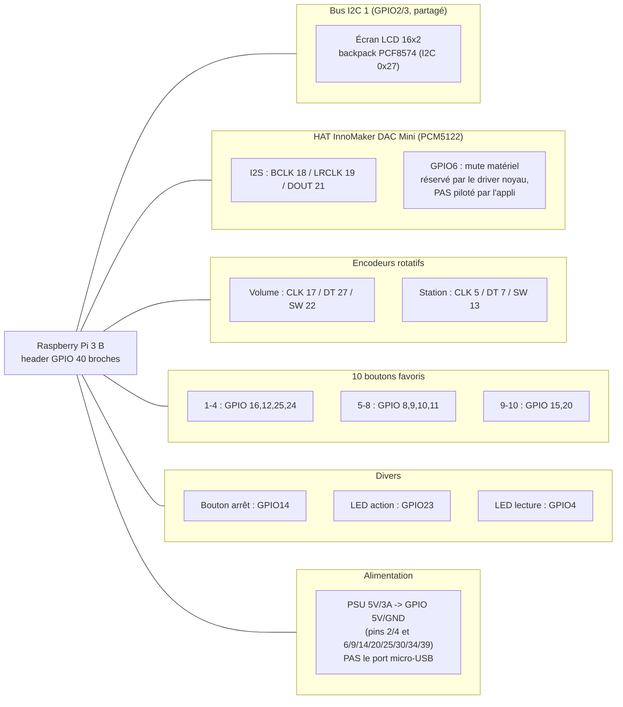

# Câblage

Référence complète du câblage GPIO du lecteur radio HiFi (Raspberry Pi 3
Model B). Source de vérité : `radio/config.py` — ce document en est la
transcription lisible, à mettre à jour en même temps si les pins changent.

Toutes les 28 broches GPIO utilisables du header 40 broches sont occupées :
aucune broche libre pour une extension future (LED, bouton, encodeur)
sans en réaffecter une existante.

## Schéma par bloc fonctionnel

## Pinout physique complet (broches 1 à 40)

Numérotation **physique** du header (position réelle du connecteur), avec le
GPIO **BCM** correspondant entre parenthèses. Colonnes gauche/droite = les
deux rangées physiques du connecteur (broches impaires à gauche, paires à
droite, comme sur le Pi lui-même).

| # | Gauche (GPIO / fonction) | # | Droite (GPIO / fonction) |
|---|---|---|---|
| 1 | 3.3V | 2 | 5V |
| 3 | GPIO2 (SDA1) — I2C LCD+DAC | 4 | 5V |
| 5 | GPIO3 (SCL1) — I2C LCD+DAC | 6 | GND |
| 7 | GPIO4 — LED lecture | 8 | GPIO14 (TXD0) — Bouton d'arrêt |
| 9 | GND | 10 | GPIO15 (RXD0) — Favori 9 |
| 11 | GPIO17 — Encodeur volume CLK | 12 | GPIO18 — I2S BCLK (HAT) |
| 13 | GPIO27 — Encodeur volume DT | 14 | GND |
| 15 | GPIO22 — Encodeur volume SW | 16 | GPIO23 — LED action |
| 17 | 3.3V | 18 | GPIO24 — Favori 4 |
| 19 | GPIO10 (MOSI) — Favori 7 | 20 | GND |
| 21 | GPIO9 (MISO) — Favori 6 | 22 | GPIO25 — Favori 3 |
| 23 | GPIO11 (SCLK) — Favori 8 | 24 | GPIO8 (CE0) — Favori 5 |
| 25 | GND | 26 | GPIO7 (CE1) — Encodeur station DT |
| 27 | ID_SD (GPIO0) — réservé EEPROM HAT | 28 | ID_SC (GPIO1) — réservé EEPROM HAT |
| 29 | GPIO5 — Encodeur station CLK | 30 | GND |
| 31 | GPIO6 — Mute DAC, réservé kernel, **non piloté par l'appli** | 32 | GPIO12 — Favori 2 |
| 33 | GPIO13 — Encodeur station SW | 34 | GND |
| 35 | GPIO19 — I2S LRCLK (HAT) | 36 | GPIO16 — Favori 1 |
| 37 | GPIO26 — réservé IR (HAT), évité par précaution | 38 | GPIO20 — Favori 10 |
| 39 | GND | 40 | GPIO21 — I2S DOUT (HAT) |

## Table par fonction

| Fonction | GPIO (BCM) | Broche physique | Notes |
|---|---|---|---|
| I2C (LCD + DAC) | 2 (SDA1), 3 (SCL1) | 3, 5 | Bus **I2C 1**, `dtparam=i2c_arm=on` requis. Partagé LCD (0x27) + DAC (adresse différente), pas de conflit. |
| I2S (HAT InnoMaker DAC Mini) | 18 (BCLK), 19 (LRCLK), 21 (DOUT) | 12, 35, 40 | Piloté par le HAT/overlay `allo-boss-dac-pcm512x-audio`, **ne jamais réutiliser**. |
| Mute DAC (HAT InnoMaker) | 6 | 31 | Revendiqué par le **driver noyau** au boot (`gpioinfo` : consumer=`mute`, actif bas). L'appli ne le pilote **pas** — mute géré en logiciel (volume mpv à 0), voir `RadioApp.on_toggle_mute`. |
| IR réservé (HAT InnoMaker) | 26 | 37 | Non câblé par défaut sur la variante Mini mais réservé par le constructeur — évité par précaution. |
| ID EEPROM (convention 40-pin) | 0, 1 | 27, 28 | Jamais utilisable pour autre chose. |
| Encodeur volume | 17 (CLK), 27 (DT), 22 (SW) | 11, 13, 15 | Bouton SW = mute logiciel (bascule volume 0 / précédent). |
| Encodeur station | 5 (CLK), 7 (DT), 13 (SW) | 29, 26, 33 | Bouton SW (appui long ~1.5s) = bascule LCD actif/éteint. |
| Favori 1 | 16 | 36 | Appui court = charge, appui long (~1.2s) = enregistre. |
| Favori 2 | 12 | 32 | idem |
| Favori 3 | 25 | 22 | idem |
| Favori 4 | 24 | 18 | idem |
| Favori 5 | 8 | 24 | idem — libre car SPI0 désactivé |
| Favori 6 | 9 | 21 | idem — libre car SPI0 désactivé |
| Favori 7 | 10 | 19 | idem — libre car SPI0 désactivé |
| Favori 8 | 11 | 23 | idem — libre car SPI0 désactivé |
| Favori 9 | 15 | 10 | idem — libre car UART désactivé |
| Favori 10 | 20 | 38 | idem — broche libre générique |
| Bouton d'arrêt | 14 | 8 | Maintien ~0.5s → arrêt propre (sudo shutdown). Libre car UART désactivé. |
| LED action | 23 | 16 | Flash bref sur changement de station / action favori. |
| LED lecture | 4 | 7 | Allumée en continu pendant la diffusion, clignote au changement de titre. |

**Attention 4 pattes (boutons favoris)** : sur les boutons poussoir à 4
pattes utilisés ici, les deux pattes du **même côté** sont pontées en
permanence à l'intérieur du boîtier, indépendamment de l'appui — seule la
paire **en diagonale** est le vrai contact de commutation. Un bouton câblé
sur une paire du même côté lit en permanence "appuyé". Vérifier au
multimètre (continuité à vide, sans le Pi) avant de câbler tout nouveau
bouton de ce type.

## Alimentation

Le Pi est alimenté **directement sur les broches GPIO 5V/GND** (pins 2/4 et
une masse parmi 6/9/14/20/25/30/34/39), **pas** par le port micro-USB —
choix fait pour réutiliser un bloc 5V/3A existant sans adaptateur, au prix
de contourner le fusible/protection du port micro-USB (polarité à vérifier
soigneusement à chaque intervention sur ce câblage).

Historique de diagnostic sous-tension (chute résistive, transitoires,
soudures) : voir les notes datées dans le suivi de projet, non reproduites
ici pour éviter la duplication — ce fichier documente le câblage tel qu'il
doit être, pas l'historique de debug.
